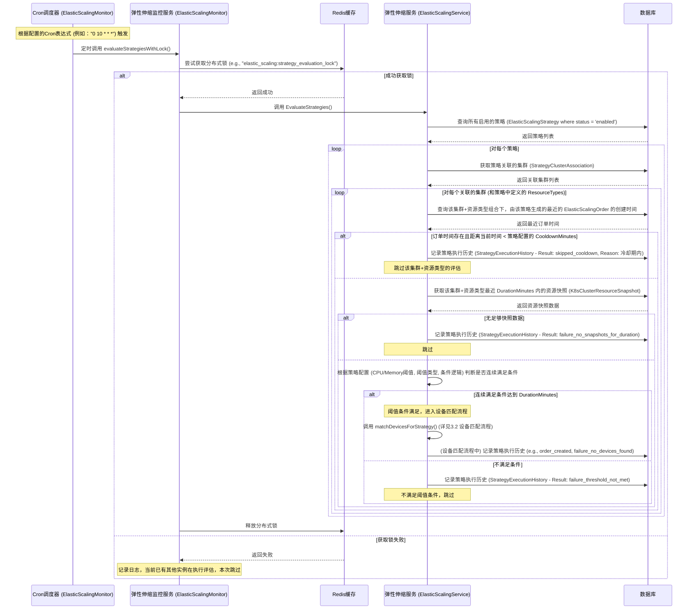
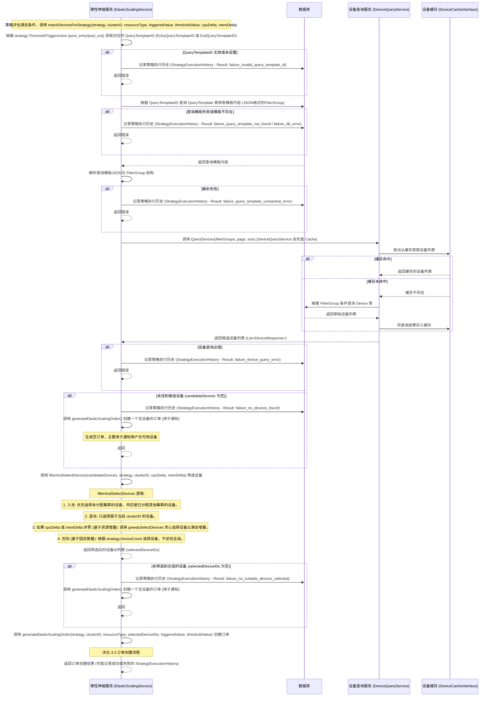
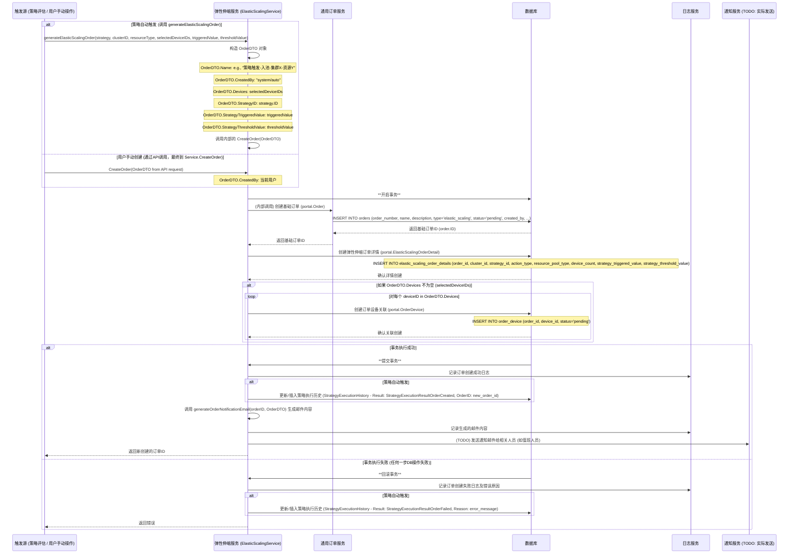
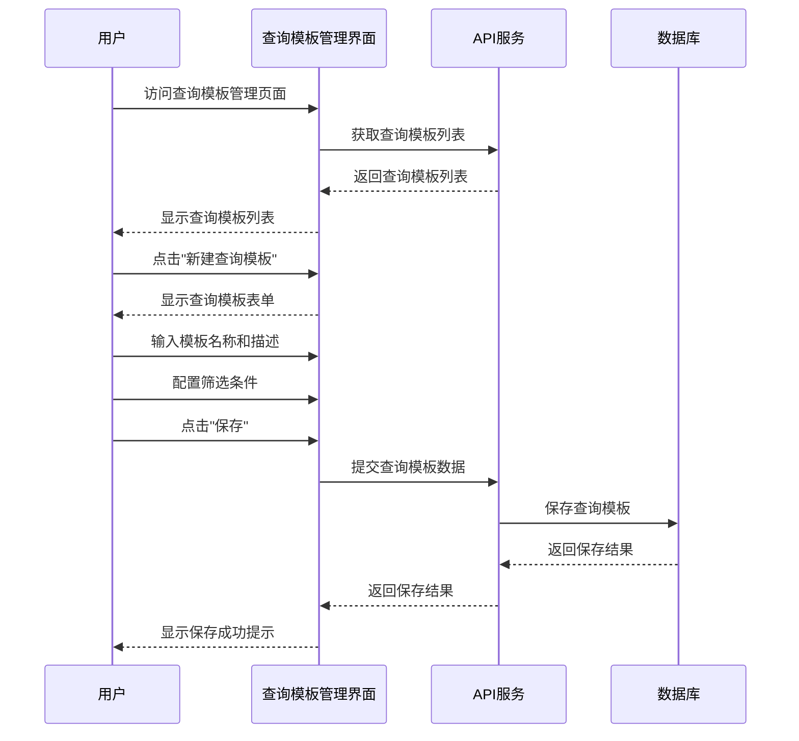
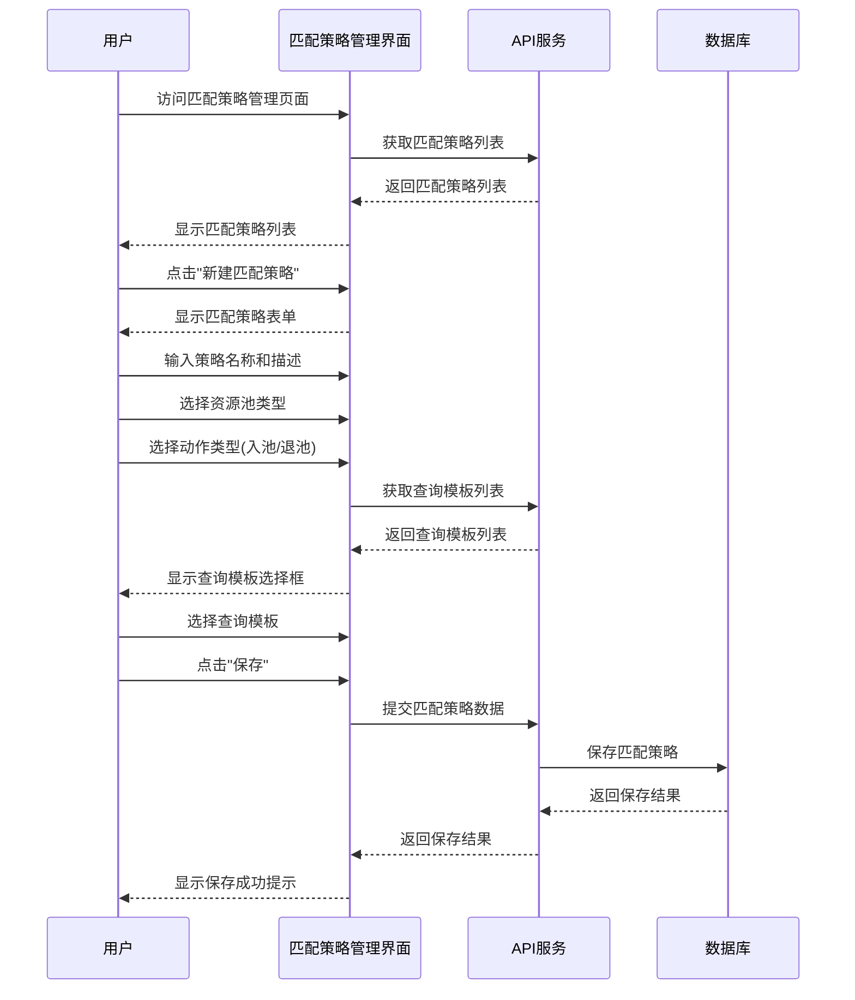
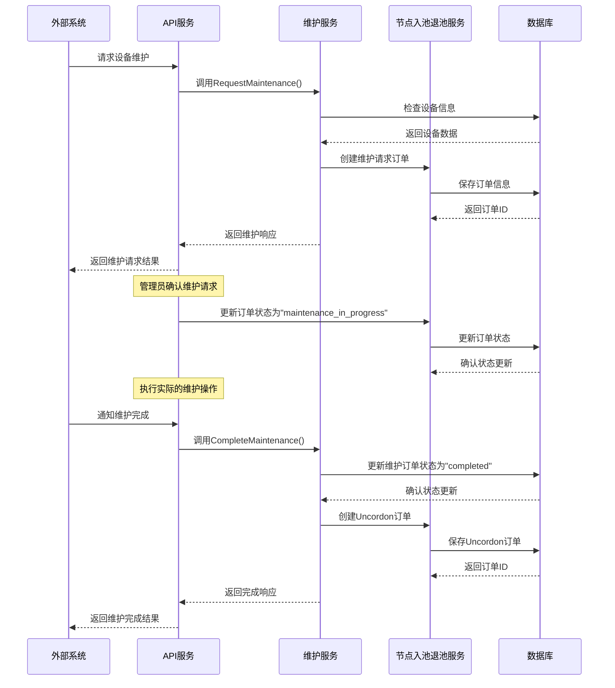
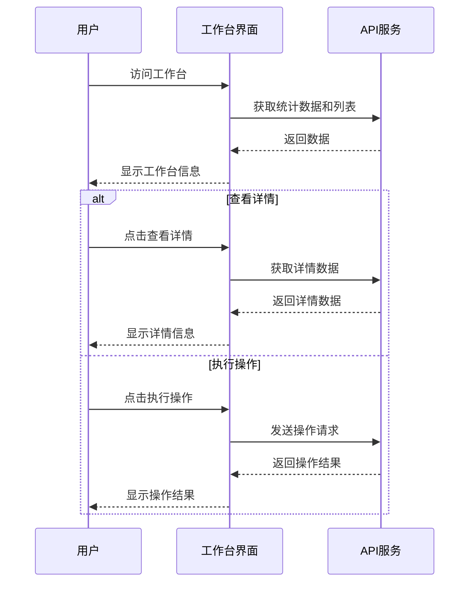
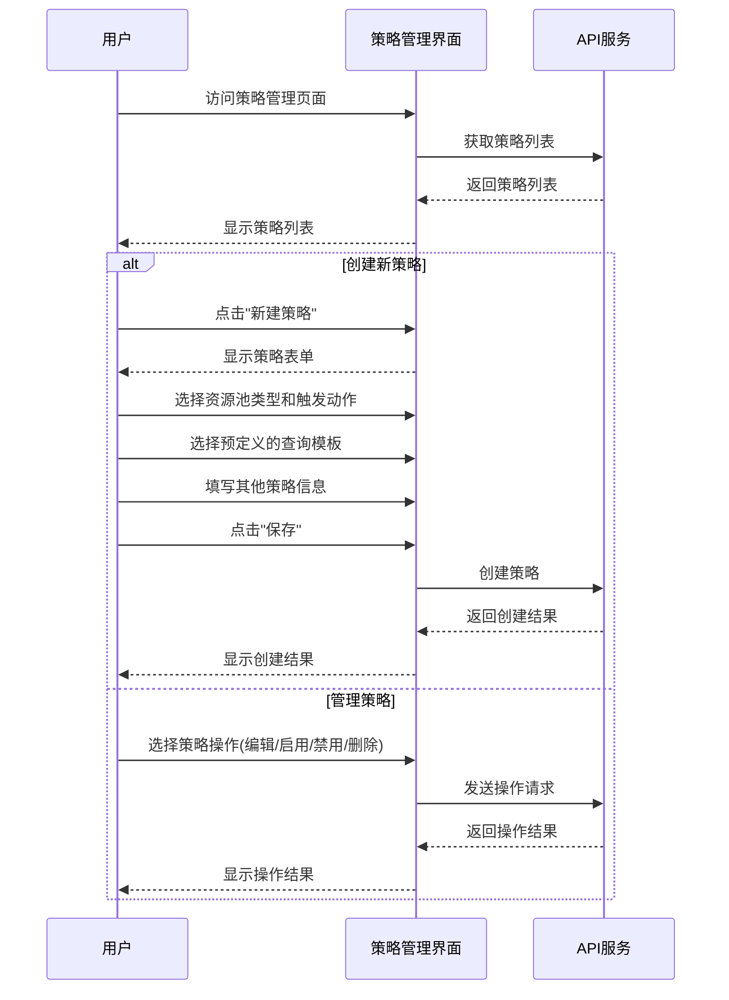
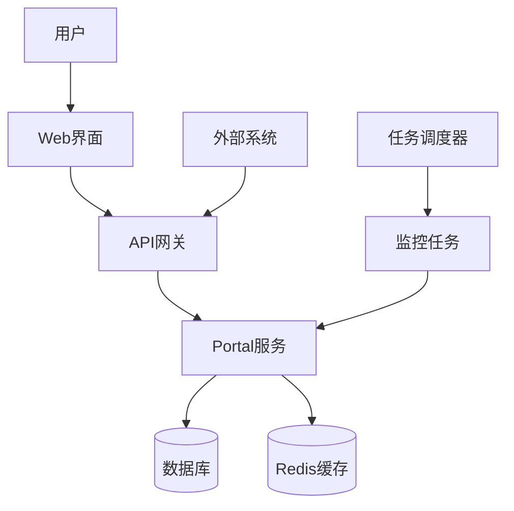

# K8s 集群节点入池退池管理系统设计文档

## 1. 系统概述

K8s 集群节点入池退池管理系统 (以下简称“本系统”) 是一个用于监控和管理 Kubernetes 集群节点资源的平台，它能够根据预设的策略自动或手动进行节点的入池和退池操作，以优化资源利用率和应用性能。系统提供了可视化的工作台，用于监控集群资源使用情况、管理节点入池退池策略 (ElasticScalingStrategy)，并处理由此产生的节点入池退池订单 (ElasticScalingOrder)。

### 1.1 系统目标

- 提供集群资源使用情况的实时监控
- 支持基于阈值的自动节点入池退池策略配置
- 实现资源池的自动入池和退池操作
- 支持设备维护请求的处理和管理
- 提供完整的操作历史记录和通知机制

### 1.2 核心功能

- 集群资源监控与统计
- 节点入池退池策略管理 (ElasticScalingStrategy)
- 节点入池退池订单处理 (ElasticScalingOrder & OrderDevice)
- 策略执行历史记录 (StrategyExecutionHistory)
- 设备维护管理 (通过通用订单类型 `maintenance` 实现，与弹性伸缩订单分离)
- 通知和报告系统 (NotificationLog, DutyRoster)

## 2. 系统架构

### 2.1 整体架构

系统采用前后端分离的架构，主要包括以下组件：

1. **前端应用**：基于 React 和 Ant Design 的单页应用
2. **后端服务**：基于 Go 语言的 RESTful API 服务，核心包括：
    - `ElasticScalingService`: 负责弹性伸缩策略的评估、设备匹配、订单创建和管理等核心业务逻辑。
    - `ElasticScalingMonitor`: 负责定时触发策略评估，使用 Cron 表达式调度，并通过 Redis 分布式锁确保评估任务的唯一性。
    - `OrderService`: 通用的订单服务，被 `ElasticScalingService` 用于创建和管理基础订单。
    - `DeviceQueryService`: 提供设备查询能力，被 `ElasticScalingService` 用于根据查询模板匹配设备。
3. **定时任务 (`ElasticScalingMonitor`)**：负责策略评估和资源监控的后台任务，通过 Cron 调度。
4. **数据库**：存储系统配置、策略、订单、订单设备关联、历史记录、设备信息、查询模板等。
5. **缓存服务**：
    - **Redis**: 用于分布式锁（如策略评估锁）、缓存查询模板、缓存设备列表等。
    - **设备缓存 (`DeviceCacheInterface`)**: 抽象的设备缓存接口，具体实现可基于 Redis，用于缓存设备信息和字段值，提高查询效率。
6. **通知服务**：支持邮件、系统内通知等多种通知方式，记录通知日志 (`NotificationLog`)，并可集成值班系统 (`DutyRoster`)。

### 2.2 数据模型

系统的核心数据模型包括：

1. **节点入池退池策略 (ElasticScalingStrategy)**：定义节点入池或退池的触发条件（CPU、内存阈值、持续时间）、目标值、执行动作（入池/退池）、设备数量、冷却时间、关联的设备查询模板ID (`EntryQueryTemplateID`, `ExitQueryTemplateID`) 等。
2. **订单 (Order)**：基础订单模型，包含订单号、名称、类型（如 `elastic_scaling`, `maintenance`）、状态、创建人等通用信息。
3. **弹性伸缩订单详情 (ElasticScalingOrderDetail)**：存储弹性伸缩操作特有的信息，如关联的集群ID、策略ID、操作类型（入池/退池）、资源池类型、请求的设备数量、策略触发时的指标值和阈值等。它通过 `OrderID` 与基础订单关联。
4. **订单设备关联 (OrderDevice)**：记录订单与具体设备之间的关联关系，包括订单ID、设备ID以及设备在订单中的状态（如 `pending`, `completed`）。这是多对多关系的实现。
5. **策略执行历史 (StrategyExecutionHistory)**：记录策略的每次评估和执行结果，包括执行时间、触发值、阈值、执行结果（如 `order_created`, `failure_no_devices_found`）、关联的订单ID（如果生成了订单）以及失败原因等。
6. **设备 (Device)**：记录集群中的设备信息，如 CI Code、IP、架构、CPU、内存、状态、所属集群等。
7. **查询模板 (QueryTemplate)**：存储设备查询的条件组合，用于设备匹配流程。策略中会引用查询模板的ID。
8. **通知日志 (NotificationLog)**：记录系统发送的通知信息。
9. **值班表 (DutyRoster)**：记录值班人员信息，用于通知。
10. **K8s集群 (K8sCluster)**：记录K8s集群信息。
11. **资源快照 (K8sClusterResourceSnapshot)**: 记录集群资源使用情况的快照数据。

## 3. 核心流程

### 3.1 策略评估流程 (ElasticScalingMonitor & ElasticScalingService)



#### 策略评估流程逻辑说明 (ElasticScalingMonitor & ElasticScalingService)

1.  **定时触发与分布式锁 (ElasticScalingMonitor)**:
    *   `ElasticScalingMonitor` 使用 `cron` 库根据配置的 Cron 表达式 (例如，`MonitorConfig.MonitorCron`) 定时触发策略评估。
    *   在执行评估前，会尝试通过 `RedisHandlerInterface.AcquireLock` 获取一个分布式锁 (例如，`elastic_scaling:strategy_evaluation_lock`)，确保同一时间只有一个监控服务实例在执行策略评估，防止重复操作。锁具有超时时间 (`MonitorConfig.LockTimeout`)。
    *   如果获取锁失败，则记录日志并跳过本次评估。
    *   评估完成后（无论成功或失败），释放锁。

2.  **策略与集群遍历 (ElasticScalingService.EvaluateStrategies)**:
    *   获取所有状态为 `enabled` 的 `ElasticScalingStrategy`。
    *   对每个策略，获取其通过 `StrategyClusterAssociation` 关联的所有集群。

3.  **冷却期检查 (Cooldown)**:
    *   针对每个策略、每个关联集群及其定义的 `ResourceTypes`（资源池类型），查询数据库中由该策略为该集群和资源池组合生成的最新 `ElasticScalingOrder` 的创建时间。
    *   如果该订单存在，并且其创建时间距离当前评估时间小于策略中配置的 `CooldownMinutes`，则记录一条跳过执行的 `StrategyExecutionHistory`，并跳过对此集群和资源池的后续评估，以避免过于频繁的操作。

4.  **资源快照与阈值判断**:
    *   如果通过冷却期检查，则从 `K8sClusterResourceSnapshot` 表中获取该集群和资源池在过去 `DurationMinutes`（策略配置的持续时间）内的资源使用快照。
    *   如果没有足够的快照数据覆盖 `DurationMinutes`，则记录失败历史并跳过。
    *   根据策略中定义的 `CPUThresholdValue`, `CPUThresholdType` (usage/allocated), `MemoryThresholdValue`, `MemoryThresholdType`, 以及 `ConditionLogic` (AND/OR)，判断资源使用率是否连续在 `DurationMinutes` 内满足触发条件 (`ThresholdTriggerAction` 为 `pool_entry` 时是超过阈值，`pool_exit` 时是低于阈值)。

5.  **触发设备匹配**: 
    *   如果连续满足条件，则调用 `matchDevicesForStrategy` 方法进入设备匹配流程 (详见 3.2)。
    *   如果不满足条件，则记录一条 `failure_threshold_not_met` 的 `StrategyExecutionHistory`。

6.  **记录执行历史 (StrategyExecutionHistory)**:
    *   在评估的各个阶段（如跳过冷却、无快照、未达阈值、设备匹配结果等），都会向 `StrategyExecutionHistory` 表中记录详细的执行信息，包括策略ID、执行时间、触发值、阈值、执行结果 (`Result` 字段，如 `skipped_cooldown`, `failure_no_snapshots_for_duration`, `failure_threshold_not_met`, `order_created`, `failure_no_devices_found` 等)以及可能关联的订单ID和失败原因。


### 3.2 设备匹配流程 (ElasticScalingService.matchDevicesForStrategy)



#### 设备匹配流程详细说明 (ElasticScalingService.matchDevicesForStrategy)

1.  **获取查询模板ID**:
    *   根据策略 (`ElasticScalingStrategy`) 的 `ThresholdTriggerAction` (入池 `pool_entry` 或退池 `pool_exit`)，确定使用 `EntryQueryTemplateID` 还是 `ExitQueryTemplateID`。
    *   如果对应的模板ID未设置或为0，记录执行历史 (`failure_invalid_query_template_id`) 并返回错误。

2.  **获取并解析查询模板**:
    *   根据获取到的 `queryTemplateID` 从 `QueryTemplate` 表中查询模板记录。
    *   如果查询失败或模板不存在，记录执行历史 (`failure_query_template_not_found` 或 `failure_db_error`) 并返回错误。
    *   查询到的模板内容 (通常是JSON字符串) 会被解析成 `[]FilterGroup` 结构，这是设备查询服务所需的格式。如果解析失败，记录执行历史 (`failure_query_template_unmarshal_error`) 并返回错误。

3.  **查询候选设备 (`DeviceQueryService.QueryDevices`)**:
    *   调用 `DeviceQueryService` 的 `QueryDevices` 方法，传入解析后的 `filterGroups`。`DeviceQueryService` 内部会:
        *   首先尝试从设备缓存 (`DeviceCacheInterface`) 中根据查询条件的哈希值获取设备列表。
        *   如果缓存未命中，则根据 `filterGroups` 中的条件直接查询数据库 (`Device` 表)。
        *   查询结果会更新到缓存中，以供后续相同查询使用。
    *   返回一个包含候选设备信息的列表 (`[]DeviceResponse`)。
    *   如果设备查询过程中发生错误，记录执行历史 (`failure_device_query_error`) 并返回。
    *   如果未查询到任何候选设备，记录执行历史 (`failure_no_devices_found`)，然后调用 `generateElasticScalingOrder` 创建一个不包含任何设备的订单（主要目的是为了通知管理员无可用设备），之后流程结束。

4.  **筛选和选择设备 (`filterAndSelectDevices`)**:
    *   对查询到的 `candidateDevices` 进行筛选和选择，具体逻辑如下：
        *   **入池 (`TriggerActionPoolEntry`)**: 优先选择 `ClusterID` 为0或 `Cluster` 为空的设备（未分配集群的设备），其次是已分配给其他集群的设备。目的是优先使用空闲设备。
        *   **退池 (`TriggerActionPoolExit`)**: 只选择 `ClusterID` 与当前策略评估的 `clusterID` 相同的设备。
        *   **数量确定**: 
            *   如果 `cpuDelta` 或 `memDelta`（由策略评估计算出的所需资源变化量）不为零，则调用 `greedySelectDevices` 方法。该方法会尝试通过贪心算法选择一组设备，使得这些设备的总CPU和内存尽可能接近（但不超过，对于入池；或不低于，对于退池）所需的 `cpuDelta` 和 `memDelta`。
            *   如果 `cpuDelta` 和 `memDelta` 均为零（通常表示策略基于固定设备数量），则根据策略中配置的 `DeviceCount` 来选择设备。如果 `DeviceCount` 小于等于0，则默认为1。如果筛选出的合适设备数量少于 `DeviceCount`，则选择所有合适的设备。
    *   返回最终选定的设备ID列表 (`selectedDeviceIDs`)。
    *   如果经过筛选后没有合适的设备 (`selectedDeviceIDs` 为空)，记录执行历史 (`failure_no_suitable_devices_selected`)，然后调用 `generateElasticScalingOrder` 创建一个无设备的订单，之后流程结束。

5.  **生成订单 (`generateElasticScalingOrder`)**:
    *   如果成功筛选到设备，则调用 `generateElasticScalingOrder` 方法，传入策略信息、集群ID、资源类型、选定的设备ID列表、触发值和阈值，以创建实际的弹性伸缩订单。详见 3.3 订单创建流程。
    *   此步骤的结果（订单创建成功或失败）会再次记录到 `StrategyExecutionHistory`。


### 3.3 订单创建流程 (ElasticScalingService.generateElasticScalingOrder / CreateOrder)



#### 订单创建流程详细说明

订单创建可以由策略自动触发 (`generateElasticScalingOrder` 内部调用 `CreateOrder`) 或用户通过API手动发起 (`CreateOrder`)。

1.  **DTO准备**:
    *   **策略触发**: `generateElasticScalingOrder` 方法会根据策略信息、匹配到的设备等参数，构造一个 `OrderDTO` 对象。订单名称会自动生成（如“策略触发-入池-集群X-资源Y”），`CreatedBy` 设为 `system/auto`，并填充设备ID列表、策略相关信息。
    *   **手动创建**: API层接收用户请求，转换为 `OrderDTO`，`CreatedBy` 为当前操作用户。

2.  **事务处理**: 所有数据库操作都在一个事务内执行，以确保数据一致性。

3.  **创建基础订单 (`portal.Order`)**:
    *   调用 `OrderService`（或直接在 `ElasticScalingService` 中实现）创建一个基础的 `portal.Order` 记录。
    *   订单号 (`OrderNumber`) 会自动生成（例如基于时间戳和随机数）。
    *   订单类型 (`Type`) 固定为 `elastic_scaling`。
    *   初始状态 (`Status`) 通常为 `pending`。
    *   保存到 `orders` 表。

4.  **创建弹性伸缩订单详情 (`portal.ElasticScalingOrderDetail`)**:
    *   创建一个 `portal.ElasticScalingOrderDetail` 记录，包含特定于弹性伸缩的信息，如 `ClusterID`, `StrategyID` (如果由策略触发), `ActionType` (pool\_entry/pool\_exit), `ResourcePoolType`, `DeviceCount` (请求的设备数量，可能与实际关联的设备数量不同，特别是对于空订单或部分满足的订单), `StrategyTriggeredValue`, `StrategyThresholdValue`。
    *   `OrderID` 字段关联到上一步创建的基础订单ID。
    *   保存到 `elastic_scaling_order_details` 表。

5.  **创建订单设备关联 (`portal.OrderDevice`)**:
    *   如果 `OrderDTO.Devices` (即 `selectedDeviceIDs`) 列表不为空，则遍历该列表。
    *   为每个 `deviceID` 创建一条 `portal.OrderDevice` 记录，关联 `OrderID` 和 `DeviceID`，初始状态 (`Status`) 通常为 `pending`。
    *   保存到 `order_device` 表。这一步将订单与实际操作的设备关联起来。

6.  **事务提交/回滚**:
    *   如果以上所有数据库操作均成功，则提交事务。
    *   如果任何一步失败，则回滚事务，所有更改都将被撤销。

7.  **后续操作 (事务成功后)**:
    *   记录订单创建成功的日志。
    *   **策略触发时**: 更新 `StrategyExecutionHistory` 表，将对应策略执行记录的 `Result` 更新为 `StrategyExecutionResultOrderCreated`，并关联新创建的 `OrderID`。
    *   调用 `generateOrderNotificationEmail` 方法根据订单信息和DTO生成通知邮件的内容。实际的邮件发送逻辑 (调用外部邮件服务、查询值班人员等) 在代码中标记为 TODO，需要具体实现。
    *   向调用方返回新创建的订单ID。

8.  **失败处理 (事务失败后)**:
    *   记录订单创建失败的日志及具体的错误信息。
    *   **策略触发时**: 更新 `StrategyExecutionHistory` 表，将 `Result` 更新为 `StrategyExecutionResultOrderFailed`，并记录失败原因。
    *   向调用方返回错误。

### 3.4 订单处理与状态流转

订单创建后，其状态会根据用户操作或系统自动处理而发生变化。核心方法是 `ElasticScalingService.UpdateOrderStatus`。

```mermaid
sequenceDiagram
    participant Actor as 操作者 (用户 / 系统)
    participant API as API服务 (若用户操作)
    participant Service as 弹性伸缩服务 (ElasticScalingService)
    participant DB as 数据库
    participant Logger as 日志服务
    participant NotificationService as 通知服务 (TODO)

    Actor->>Service: 调用 UpdateOrderStatus(orderID, newStatus, userID, failureReason, deviceStatusMap, executionTime, completionTime)
    Note over Service: deviceStatusMap: map[deviceID]newDeviceStatus (可选, 用于更新OrderDevice状态)

    Service->>DB: **开启事务**
    Service->>DB: 查询订单 (portal.Order) 及关联的 ElasticScalingOrderDetail
    alt 订单不存在或类型不匹配
        DB-->>Service: 返回错误
        Service->>DB: **回滚事务**
        Service-->>Actor: 返回错误 (e.g., errOrderNotFound)
    end
    DB-->>Service: 返回订单信息

    Service->>Service: 校验 newStatus 是否为有效状态流转
    alt 无效状态流转
        Service->>DB: **回滚事务**
        Service-->>Actor: 返回错误 (e.g., errInvalidOrderStatus)
    end

    Service->>DB: 更新 Order 表: status = newStatus, executor = userID, failure_reason = failureReason, execution_time = executionTime, completion_time = completionTime
    DB-->>Service: 确认Order更新

    alt deviceStatusMap 非空且订单有关联设备
        Service->>DB: 查询订单关联的 OrderDevice 记录
        DB-->>Service: 返回 OrderDevice 列表
        loop 对每个 deviceID in deviceStatusMap
            alt 订单中存在该设备
                Service->>DB: 更新 OrderDevice 表: status = deviceStatusMap[deviceID] WHERE order_id = orderID AND device_id = deviceID
                DB-->>Service: 确认OrderDevice更新
            else 设备不在订单中
                Service->>Logger: 记录警告: 设备不在订单中，跳过更新
            end
        end
    end

    alt 事务执行成功
        DB->>Service: **提交事务**
        Service->>Logger: 记录订单状态更新成功日志

        alt 如果订单由策略创建 (order.ElasticScalingDetail.StrategyID 不为nil)
            Service->>Service: 根据 newStatus 确定 StrategyExecutionResult (e.g., OrderProcessingStarted, OrderCompleted)
            Service->>DB: 记录/更新 StrategyExecutionHistory (关联 StrategyID 和 OrderID)
            Note over DB: Result, Reason (e.g., "Order completed by user X")
        end

        Service->>Service: (可选) 生成状态变更通知邮件内容
        Service->>NotificationService: (TODO) 发送通知
        Service-->>Actor: 返回成功
    else 事务执行失败
        DB->>Service: **回滚事务**
        Service->>Logger: 记录订单状态更新失败日志
        Service-->>Actor: 返回错误
    end
```

#### 订单状态流转与处理逻辑 (`UpdateOrderStatus`)

1.  **输入参数**: `orderID`, `newStatus` (目标状态), `userID` (操作人), `failureReason` (失败时填写), `deviceStatusMap` (可选，用于更新订单关联设备的具体状态), `executionTime`, `completionTime`。

2.  **事务与校验**:
    *   操作在数据库事务中进行。
    *   查询订单是否存在，类型是否为 `elastic_scaling`。
    *   校验 `newStatus` 是否是当前订单状态的一个有效转换（例如，不能从 `completed` 直接变为 `pending`）。

3.  **更新订单 (`Order` 表)**:
    *   将订单的 `status` 更新为 `newStatus`。
    *   更新 `executor`, `failure_reason`, `execution_time` (首次进入 `processing` 状态时), `completion_time` (进入 `completed`, `failed`, `cancelled` 状态时)。

4.  **更新订单设备状态 (`OrderDevice` 表)**:
    *   如果提供了 `deviceStatusMap` (一个 `map[int64]string`，键是设备ID，值是设备的新状态)，则遍历此map。
    *   对于每个设备ID，如果它确实关联在此订单中，则更新 `OrderDevice` 表中对应记录的 `status`。

5.  **事务提交/回滚**.

6.  **后续操作 (事务成功后)**:
    *   记录日志。
    *   **策略关联更新**: 如果该订单是由某个策略创建的 (`ElasticScalingOrderDetail.StrategyID` 非空)，则需要根据 `newStatus` 确定一个对应的 `StrategyExecutionResult` (例如，`newStatus` 为 `processing` 时，结果可能是 `StrategyExecutionResultOrderProcessingStarted`；`newStatus` 为 `completed` 时，结果是 `StrategyExecutionResultOrderCompleted`)。
        *   然后向 `StrategyExecutionHistory` 表中为该策略和订单记录一条新的执行历史，或更新已有的相关历史。
    *   (TODO) 生成并发送订单状态变更的通知邮件。

**主要订单状态 (`portal.OrderStatus`)**: 
*   `pending`: 待处理 (初始状态)
*   `processing`: 处理中 (用户开始执行，或系统自动开始)
*   `returning`: 归还中 (退池订单专用，表示设备正在执行退池流程)
*   `return_completed`: 归还完成 (退池订单专用，设备已成功退池)
*   `no_return`: 无需归还 (退池订单专用，例如设备已不存在或无法归还)
*   `completed`: 已完成 (所有操作成功)
*   `failed`: 失败 (操作过程中发生错误)
*   `cancelled`: 已取消 (用户或系统取消)
*   `ignored`: 已忽略 (用户选择忽略此订单)

用户或系统根据实际操作流程，调用 `UpdateOrderStatus` 来驱动订单在这些状态间流转。例如，用户在界面上点击“开始处理”按钮，前端调用API，后端服务调用 `UpdateOrderStatus(orderID, "processing", userID, ...)`。    participant DB as 数据库
    participant Notification as 通知服务

    Note over User: 收到订单通知

    alt 用户选择忽略订单
        User->>API: 忽略订单
        API->>Service: 调用UpdateOrderStatus("ignored")
        Service->>DB: 更新订单状态为"ignored"
        DB-->>Service: 确认状态更新
        Note over Service: 订单在工作台不再显示，但计入冷却期计算
    else 用户处理订单
        User->>API: 执行订单
        API->>Service: 调用UpdateOrderStatus("processing")
        Service->>DB: 更新订单状态
        DB-->>Service: 确认状态更新

        Note over Service: 执行实际的节点入池/退池操作

        Service->>DB: 更新订单状态为"completed"
        DB-->>Service: 确认状态更新
        Service->>Notification: 发送完成通知
        Notification-->>User: 通知订单完成
    end
```

### 3.5 查询模板创建流程



### 3.6 资源池设备匹配策略创建流程



### 3.7 设备维护流程



## 4. 用户交互流程

### 4.1 工作台交互流程



### 4.2 策略管理交互流程



## 5. 系统组件详细设计

### 5.1 节点入池退池服务 (ElasticScalingService)

节点入池退池服务 (ElasticScalingService) 是系统的核心组件，负责节点入池退池策略评估、相应订单的创建和处理等核心功能。

主要功能：
- 节点入池退池策略管理（创建、更新、删除、查询）
- 节点入池退池订单管理（创建、更新状态、查询）
- 策略评估（定时评估所有启用的节点入池退池策略）
- 策略执行历史记录
- 资源池设备匹配（根据查询模板匹配设备进行入池或退池）

### 5.2 监控服务 (ElasticScalingMonitor)

监控服务负责定时触发策略评估，并确保在分布式环境中策略评估的正确执行。

主要功能：
- 定时触发策略评估
- 使用分布式锁确保单实例执行
- 监控策略评估的执行状态

### 5.3 维护服务 (MaintenanceService)

维护服务负责处理设备维护请求，包括创建维护订单、更新维护状态等。

主要功能：
- 接收外部系统的维护请求
- 创建维护订单
- 处理维护完成通知
- 创建设备恢复订单

### 5.4 通知服务

通知服务负责向用户发送各类通知，包括策略触发通知、订单状态变更通知等。

主要功能：
- 发送邮件通知
- 发送系统内通知
- 记录通知历史
- 向值班人员发送运维通知

### 5.5 资源池设备匹配服务

资源池设备匹配服务负责根据策略配置的查询模板，匹配符合条件的设备进行入池或退池操作。

主要功能：
- 根据资源池类型和查询模板匹配设备
- 支持入池和退池两种场景的设备匹配
- 随机选择符合条件的设备，直到满足策略预期结果

## 6. 数据模型详细设计

### 6.1 节点入池退池策略 (ElasticScalingStrategy)

```
ElasticScalingStrategy {
    id                     int64    // 主键
    name                   string   // 策略名称
    description            string   // 策略描述
    thresholdTriggerAction string   // 触发动作类型：pool_entry 或 pool_exit
    cpuThresholdValue      float64  // CPU使用率阈值
    cpuThresholdType       string   // CPU阈值类型：usage 或 allocated
    cpuTargetValue         float64  // 动作执行后CPU目标使用率
    memoryThresholdValue   float64  // 内存使用率阈值
    memoryThresholdType    string   // 内存阈值类型：usage 或 allocated
    memoryTargetValue      float64  // 动作执行后内存目标使用率
    conditionLogic         string   // 条件逻辑：AND 或 OR
    durationMinutes        int      // 持续时间（分钟）
    cooldownMinutes        int      // 冷却时间（分钟）
    deviceCount            int      // 设备数量
    nodeSelector           string   // 节点选择器
    resourceTypes          string   // 资源类型列表，逗号分隔
    entryQueryTemplateID   int64    // 入池设备查询模板ID
    exitQueryTemplateID    int64    // 退池设备查询模板ID
    status                 string   // 状态：enabled 或 disabled
    createdBy              string   // 创建者
    createdAt              datetime // 创建时间
    updatedAt              datetime // 更新时间
}
```

### 6.2 节点入池退池订单 (ElasticScalingOrder)

```
ElasticScalingOrder {
    id                     int64    // 主键
    orderNumber            string   // 唯一订单号
    clusterId              int64    // 关联集群ID
    strategyId             int64    // 关联策略ID(手动订单可为NULL)
    actionType             string   // 订单操作类型
    status                 string   // 订单状态：pending, processing, completed, failed, cancelled, ignored
    deviceCount            int      // 请求的设备数量
    deviceId               int64    // 涉及的特定设备ID(维护订单)
    createdBy              string   // 创建者
    executor               string   // 执行人
    executionTime          datetime // 执行时间
    completionTime         datetime // 完成时间
    failureReason          string   // 失败原因
    maintenanceStartTime   datetime // 维护开始时间
    maintenanceEndTime     datetime // 维护结束时间
    externalTicketId       string   // 外部工单号
    strategyTriggeredValue string   // 策略触发时的具体指标值
    strategyThresholdValue string   // 策略触发时的阈值设定
    createdAt              datetime // 创建时间
    updatedAt              datetime // 更新时间
}
```

### 6.3 查询模板 (QueryTemplate)

```
QueryTemplate {
    id          int64    // 主键
    name        string   // 模板名称
    description string   // 模板描述
    groups      string   // 筛选组列表，JSON格式
    createdBy   string   // 创建者
    updatedBy   string   // 更新者
    createdAt   datetime // 创建时间
    updatedAt   datetime // 更新时间
}
```

### 6.4 资源池设备匹配策略 (ResourcePoolDeviceMatchingPolicy)

```
ResourcePoolDeviceMatchingPolicy {
    id                  int64    // 主键
    name                string   // 策略名称
    description         string   // 策略描述
    resourcePoolType    string   // 资源池类型
    actionType          string   // 动作类型：pool_entry 或 pool_exit
    queryTemplateId     int64    // 关联的查询模板ID
    status              string   // 状态：enabled 或 disabled
    createdBy           string   // 创建者
    updatedBy           string   // 更新者
    createdAt           datetime // 创建时间
    updatedAt           datetime // 更新时间
}
```

## 7. API 接口设计

### 7.1 策略管理接口

| 接口                                  | 方法   | 描述                     |
|--------------------------------------|--------|-------------------------|
| /elastic-scaling/strategies          | GET    | 获取策略列表              |
| /elastic-scaling/strategies          | POST   | 创建新策略                |
| /elastic-scaling/strategies/:id      | GET    | 获取策略详情              |
| /elastic-scaling/strategies/:id      | PUT    | 更新策略                  |
| /elastic-scaling/strategies/:id      | DELETE | 删除策略                  |
| /elastic-scaling/strategies/:id/status | PUT  | 更新策略状态              |

### 7.2 订单管理接口

| 接口                                  | 方法   | 描述                     |
|--------------------------------------|--------|-------------------------|
| /elastic-scaling/orders              | GET    | 获取订单列表              |
| /elastic-scaling/orders              | POST   | 创建新订单                |
| /elastic-scaling/orders/:id          | GET    | 获取订单详情              |
| /elastic-scaling/orders/:id/status   | PUT    | 更新订单状态              |
| /elastic-scaling/orders/:id/devices  | GET    | 获取订单关联的设备         |

### 7.3 查询模板接口

| 接口                                  | 方法   | 描述                     |
|--------------------------------------|--------|-------------------------|
| /device-query/templates              | GET    | 获取查询模板列表           |
| /device-query/templates              | POST   | 创建查询模板              |
| /device-query/templates/:id          | GET    | 获取查询模板详情           |
| /device-query/templates/:id          | PUT    | 更新查询模板              |
| /device-query/templates/:id          | DELETE | 删除查询模板              |
| /device-query/query                  | POST   | 执行设备查询              |

### 7.4 资源池设备匹配策略接口

| 接口                                  | 方法   | 描述                     |
|--------------------------------------|--------|-------------------------|
| /resource-pool/matching-policies     | GET    | 获取匹配策略列表           |
| /resource-pool/matching-policies     | POST   | 创建匹配策略              |
| /resource-pool/matching-policies/:id | GET    | 获取匹配策略详情           |
| /resource-pool/matching-policies/:id | PUT    | 更新匹配策略              |
| /resource-pool/matching-policies/:id | DELETE | 删除匹配策略              |
| /resource-pool/matching-policies/:id/status | PUT | 更新匹配策略状态       |

## 8. 设备匹配策略设计

### 8.1 设计概述

设备匹配策略是节点入池退池管理系统的核心组件之一，用于在策略触发时根据预定义的查询条件匹配合适的设备进行入池或退池操作。设备匹配策略基于查询模板（QueryTemplate）实现，每个节点入池退池策略 (ElasticScalingStrategy) 可以配置两个查询模板：入池查询模板和退池查询模板。

### 8.2 查询模板结构

查询模板采用灵活的组合条件结构，支持复杂的设备筛选逻辑：

1. **筛选组（FilterGroup）**：多个筛选组之间可以使用 AND 或 OR 逻辑连接
2. **筛选块（FilterBlock）**：每个筛选组包含多个筛选块，筛选块之间可以使用 AND 或 OR 逻辑连接
3. **筛选条件**：每个筛选块定义一个具体的筛选条件，包括筛选类型、条件类型、键和值

### 8.3 筛选类型

系统支持三种主要的筛选类型：

1. **设备字段（device）**：直接匹配设备表中的字段，如 CPU 架构、内存大小、设备状态等
2. **节点标签（nodeLabel）**：匹配 Kubernetes 节点的标签
3. **节点污点（taint）**：匹配 Kubernetes 节点的污点

### 8.4 设备匹配策略的优势

1. **灵活性**：支持复杂的条件组合，满足各种设备筛选需求
2. **可重用性**：查询模板可以在多个策略中重用
3. **可维护性**：查询模板可以独立于策略进行管理和更新
4. **可扩展性**：系统设计支持添加新的筛选类型和条件类型

## 9. 部署架构



## 10. 未来扩展

1. **预测性节点调整**：基于资源使用趋势，提前进行节点入池或退池
