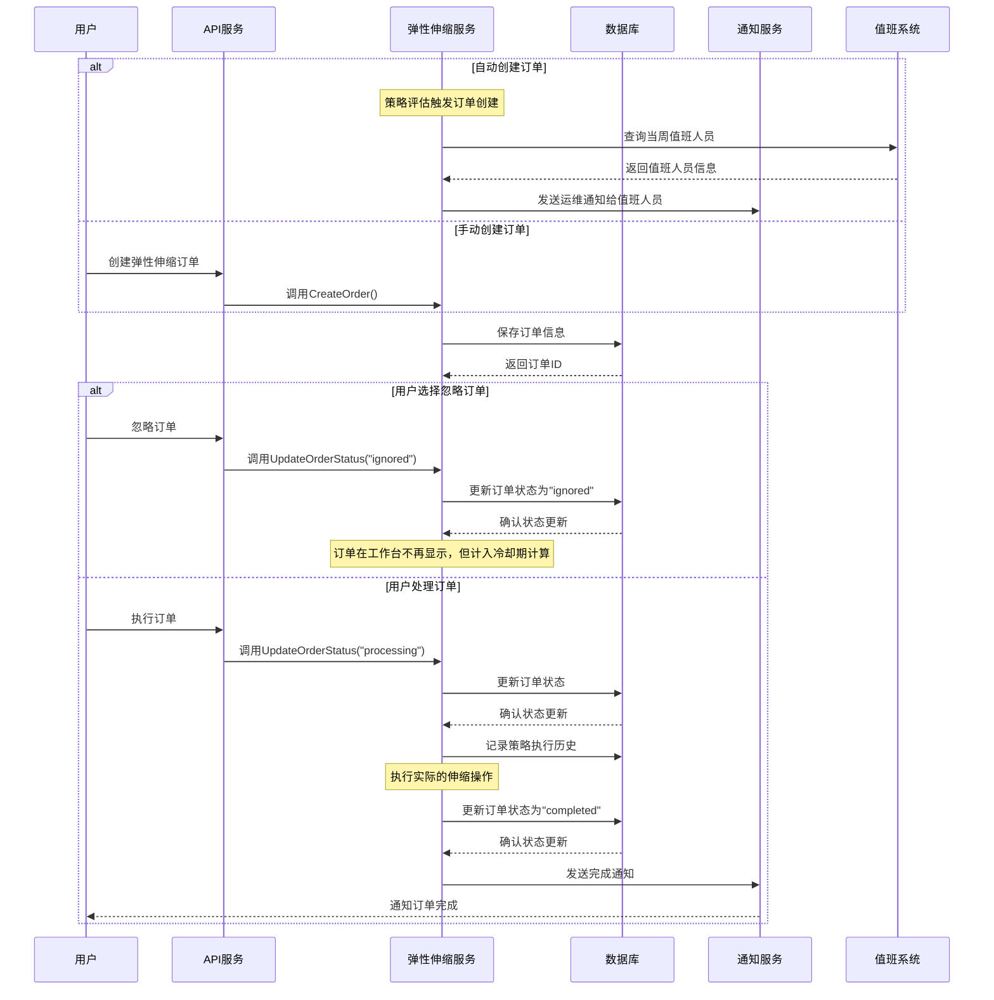
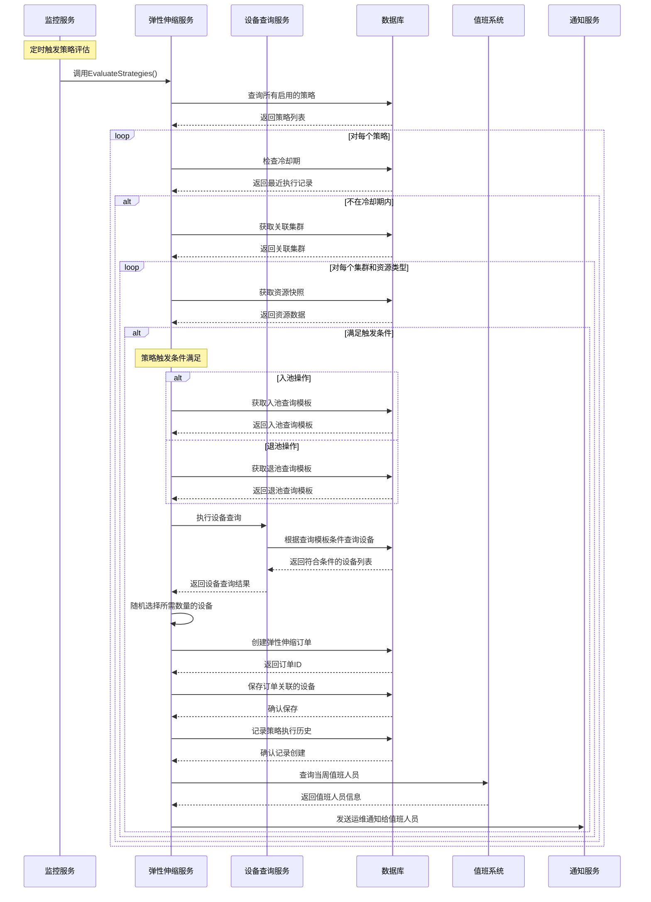
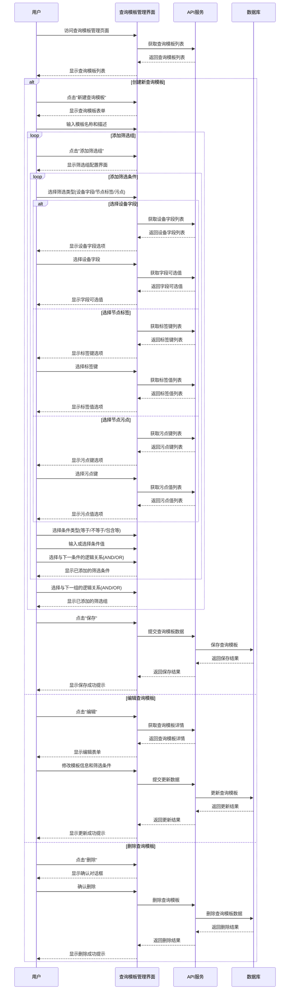
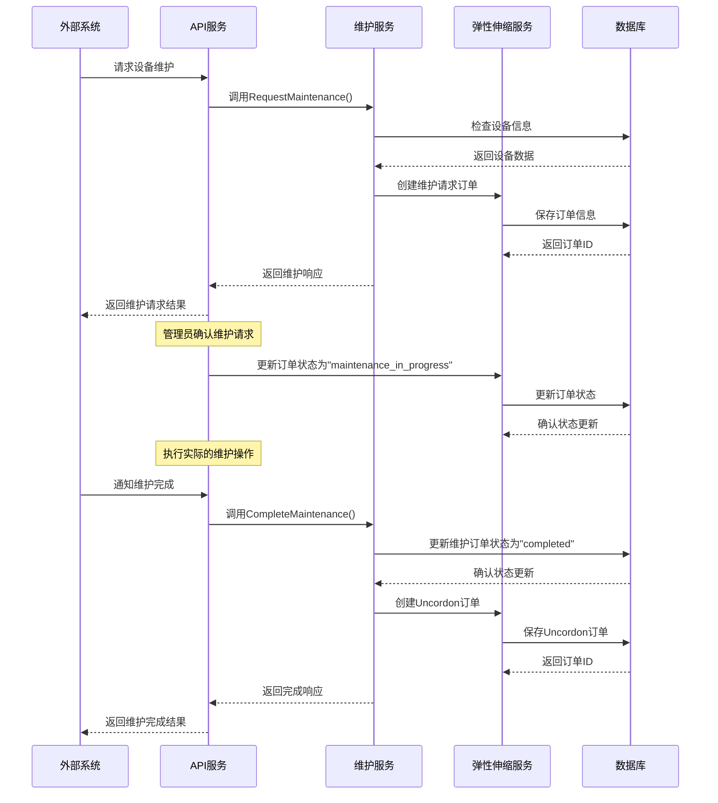
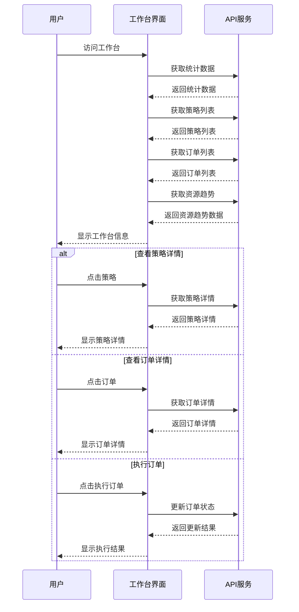
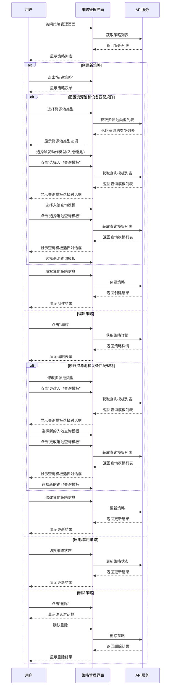
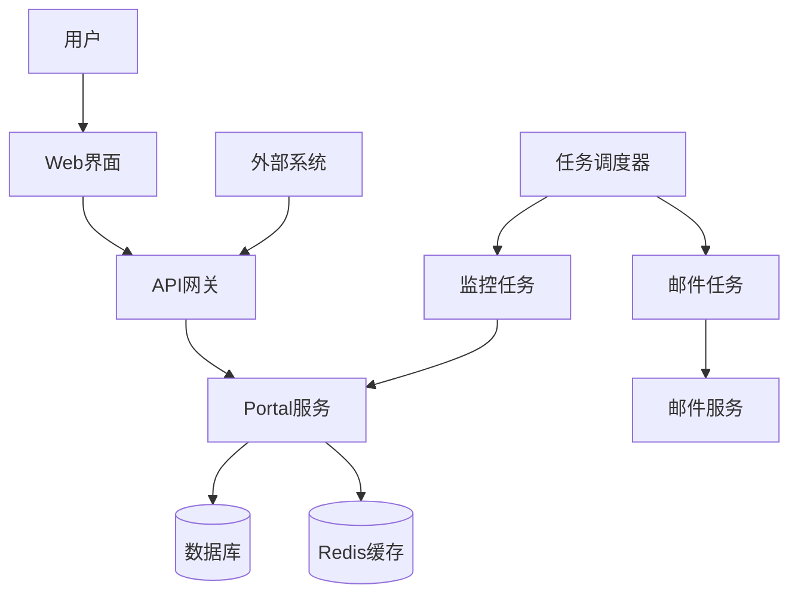

# K8s 集群资源弹性伸缩管理系统设计文档

## 1. 系统概述

K8s 集群资源弹性伸缩管理系统是一个用于监控和管理 Kubernetes 集群资源的平台，它能够根据预设的策略自动或手动调整集群资源，以优化资源利用率和应用性能。系统提供了可视化的工作台，用于监控集群资源使用情况、管理弹性伸缩策略，并处理由此产生的伸缩订单。

### 1.1 系统目标

- 提供集群资源使用情况的实时监控
- 支持基于阈值的自动弹性伸缩策略配置
- 实现资源池的自动入池和退池操作
- 支持设备维护请求的处理和管理
- 提供完整的操作历史记录和通知机制

### 1.2 核心功能

- 集群资源监控与统计
- 弹性伸缩策略管理
- 弹性伸缩订单处理
- 设备维护管理
- 通知和报告系统

## 2. 系统架构

### 2.1 整体架构

系统采用前后端分离的架构，主要包括以下组件：

1. **前端应用**：基于 React 和 Ant Design 的单页应用
2. **后端服务**：基于 Go 语言的 RESTful API 服务
3. **定时任务**：负责策略评估和资源监控的后台任务
4. **数据库**：存储系统配置、策略、订单和历史记录
5. **缓存服务**：使用 Redis 进行分布式锁和数据缓存
6. **通知服务**：支持邮件、系统内通知等多种通知方式

### 2.2 数据模型

系统的核心数据模型包括：

1. **弹性伸缩策略 (ElasticScalingStrategy)**：定义触发条件、目标值和执行动作
2. **弹性伸缩订单 (ElasticScalingOrder)**：记录伸缩操作的执行状态和结果
3. **策略执行历史 (StrategyExecutionHistory)**：记录策略的执行历史和结果
4. **资源快照 (ResourceSnapshot)**：记录集群资源使用情况的快照
5. **通知日志 (NotificationLog)**：记录系统发送的通知信息
6. **设备 (Device)**：记录集群中的设备信息

## 3. 核心流程


### 3.1 订单处理流程



### 3.2 策略评估与设备匹配流程



### 3.3 资源池设备匹配规则创建流程



### 3.4 设备维护流程



## 4. 用户交互流程

### 4.1 工作台交互流程



### 4.2 策略管理交互流程



## 5. 系统组件详细设计

### 5.1 弹性伸缩服务 (ElasticScalingService)

弹性伸缩服务是系统的核心组件，负责策略评估、订单创建和处理等核心功能。

主要功能：
- 策略管理（创建、更新、删除、查询）
- 订单管理（创建、更新状态、查询）
- 策略评估（定时评估所有启用的策略）
- 策略执行历史记录
- 资源池设备匹配（根据查询模板匹配设备）

### 5.2 监控服务 (ElasticScalingMonitor)

监控服务负责定时触发策略评估，并确保在分布式环境中策略评估的正确执行。

主要功能：
- 定时触发策略评估
- 使用分布式锁确保单实例执行
- 监控策略评估的执行状态

### 5.3 维护服务 (MaintenanceService)

维护服务负责处理设备维护请求，包括创建维护订单、更新维护状态等。

主要功能：
- 接收外部系统的维护请求
- 创建维护订单
- 处理维护完成通知
- 创建设备恢复订单

### 5.4 通知服务

通知服务负责向用户发送各类通知，包括策略触发通知、订单状态变更通知等。

主要功能：
- 发送邮件通知
- 发送系统内通知
- 记录通知历史
- 向值班人员发送运维通知

### 5.5 资源池设备匹配服务

资源池设备匹配服务负责根据策略配置的查询模板，匹配符合条件的设备进行入池或退池操作。

主要功能：
- 根据资源池类型和查询模板匹配设备
- 支持入池和退池两种场景的设备匹配
- 随机选择符合条件的设备，直到满足策略预期结果

## 6. 前端组件设计

### 6.1 工作台 (Dashboard)

工作台是系统的主界面，提供集群资源使用情况、策略执行情况和订单处理情况的概览。

主要功能：
- 显示关键统计数据
- 展示资源使用趋势图表
- 显示待处理订单列表
- 提供策略管理入口
- 支持订单处理操作

### 6.2 策略管理

策略管理界面用于创建、编辑和管理弹性伸缩策略。

主要功能：
- 策略列表展示
- 策略创建和编辑表单
- 策略启用/禁用控制
- 策略执行历史查看

### 6.3 订单管理

订单管理界面用于查看和处理弹性伸缩订单。

主要功能：
- 订单列表展示
- 订单详情查看
- 订单状态更新
- 订单执行操作

## 7. 安全与性能考虑

### 7.1 安全考虑

- 使用分布式锁确保策略评估和订单处理的并发安全
- 对关键操作进行权限控制
- 记录操作日志，便于审计和问题排查
- 敏感配置信息加密存储

### 7.2 性能考虑

- 使用缓存减少数据库访问
- 优化策略评估算法，减少不必要的资源快照查询
- 使用异步处理机制，提高系统响应性能
- 对大量数据的查询使用分页和索引优化

## 8. 数据模型详细设计

### 8.1 弹性伸缩策略 (ElasticScalingStrategy)

```
ElasticScalingStrategy {
    id                     int64    // 主键
    name                   string   // 策略名称
    description            string   // 策略描述
    thresholdTriggerAction string   // 触发动作类型：pool_entry 或 pool_exit
    cpuThresholdValue      float64  // CPU使用率阈值
    cpuThresholdType       string   // CPU阈值类型：usage 或 allocated
    cpuTargetValue         float64  // 动作执行后CPU目标使用率
    memoryThresholdValue   float64  // 内存使用率阈值
    memoryThresholdType    string   // 内存阈值类型：usage 或 allocated
    memoryTargetValue      float64  // 动作执行后内存目标使用率
    conditionLogic         string   // 条件逻辑：AND 或 OR
    durationMinutes        int      // 持续时间（分钟）
    cooldownMinutes        int      // 冷却时间（分钟）
    deviceCount            int      // 设备数量
    nodeSelector           string   // 节点选择器
    resourceTypes          string   // 资源类型列表，逗号分隔
    entryQueryTemplateID   int64    // 入池设备查询模板ID
    exitQueryTemplateID    int64    // 退池设备查询模板ID
    status                 string   // 状态：enabled 或 disabled
    createdBy              string   // 创建者
    createdAt              datetime // 创建时间
    updatedAt              datetime // 更新时间
}
```

### 8.2 弹性伸缩订单 (ElasticScalingOrder)

```
ElasticScalingOrder {
    id                     int64    // 主键
    orderNumber            string   // 唯一订单号
    clusterId              int64    // 关联集群ID
    strategyId             int64    // 关联策略ID(手动订单可为NULL)
    actionType             string   // 订单操作类型
    status                 string   // 订单状态：pending, processing, completed, failed, cancelled, ignored
    deviceCount            int      // 请求的设备数量
    deviceId               int64    // 涉及的特定设备ID(维护订单)
    createdBy              string   // 创建者
    executor               string   // 执行人
    executionTime          datetime // 执行时间
    completionTime         datetime // 完成时间
    failureReason          string   // 失败原因
    maintenanceStartTime   datetime // 维护开始时间
    maintenanceEndTime     datetime // 维护结束时间
    externalTicketId       string   // 外部工单号
    strategyTriggeredValue string   // 策略触发时的具体指标值
    strategyThresholdValue string   // 策略触发时的阈值设定
    createdAt              datetime // 创建时间
    updatedAt              datetime // 更新时间
}
```

### 8.3 策略执行历史 (StrategyExecutionHistory)

```
StrategyExecutionHistory {
    id             int64    // 主键
    strategyId     int64    // 策略ID
    executionTime  datetime // 执行时间
    triggeredValue string   // 触发策略时的具体指标值
    thresholdValue string   // 触发策略时的阈值设定
    result         string   // 执行结果
    orderId        int64    // 关联订单ID
    reason         string   // 执行原因或结果说明
    createdAt      datetime // 创建时间
    updatedAt      datetime // 更新时间
}
```

### 8.4 通知日志 (NotificationLog)

```
NotificationLog {
    id                int64    // 主键
    orderId           int64    // 关联订单ID(可选)
    strategyId        int64    // 关联策略ID(可选)
    notificationType  string   // 通知类型：email, sms, im, system
    recipient         string   // 接收人信息
    content           string   // 通知内容
    status            string   // 发送状态
    sendTime          datetime // 发送时间
    errorMessage      string   // 错误信息
    createdAt         datetime // 创建时间
    updatedAt         datetime // 更新时间
}
```

### 8.5 查询模板 (QueryTemplate)

```
QueryTemplate {
    id          int64    // 主键
    name        string   // 模板名称
    description string   // 模板描述
    groups      string   // 筛选组列表，JSON格式
    createdBy   string   // 创建者
    updatedBy   string   // 更新者
    createdAt   datetime // 创建时间
    updatedAt   datetime // 更新时间
}
```

查询模板的 `groups` 字段是一个 JSON 格式的字符串，包含了设备查询的条件组和条件块。每个条件组可以包含多个条件块，条件块之间可以使用 AND 或 OR 逻辑连接。每个条件块定义了一个具体的查询条件，如设备字段、标签或污点的匹配条件。

### 8.6 资源池设备匹配策略 (ResourcePoolDeviceMatchingPolicy)

```
ResourcePoolDeviceMatchingPolicy {
    id                  int64    // 主键
    name                string   // 策略名称
    description         string   // 策略描述
    resourcePoolType    string   // 资源池类型
    actionType          string   // 动作类型：pool_entry 或 pool_exit
    queryTemplateId     int64    // 关联的查询模板ID
    status              string   // 状态：enabled 或 disabled
    createdBy           string   // 创建者
    updatedBy           string   // 更新者
    createdAt           datetime // 创建时间
    updatedAt           datetime // 更新时间
}
```

资源池设备匹配策略用于定义特定资源池类型在入池或退池操作时应使用的设备查询模板。弹性伸缩策略在创建时可以关联这些预定义的匹配策略，而不需要每次都重新创建查询模板。

## 9. API 接口设计

### 9.1 策略管理接口

| 接口                                  | 方法   | 描述                     |
|--------------------------------------|--------|-------------------------|
| /elastic-scaling/strategies          | GET    | 获取策略列表              |
| /elastic-scaling/strategies          | POST   | 创建新策略                |
| /elastic-scaling/strategies/:id      | GET    | 获取策略详情              |
| /elastic-scaling/strategies/:id      | PUT    | 更新策略                  |
| /elastic-scaling/strategies/:id      | DELETE | 删除策略                  |
| /elastic-scaling/strategies/:id/status | PUT  | 更新策略状态              |
| /elastic-scaling/strategies/:id/execution-history | GET | 获取策略执行历史 |

### 9.2 订单管理接口

| 接口                                  | 方法   | 描述                     |
|--------------------------------------|--------|-------------------------|
| /elastic-scaling/orders              | GET    | 获取订单列表              |
| /elastic-scaling/orders              | POST   | 创建新订单                |
| /elastic-scaling/orders/:id          | GET    | 获取订单详情              |
| /elastic-scaling/orders/:id/status   | PUT    | 更新订单状态              |
| /elastic-scaling/orders/:id/devices  | GET    | 获取订单关联的设备         |
| /elastic-scaling/orders/:id/devices/:deviceId/status | PUT | 更新订单设备状态 |

### 9.3 统计接口

| 接口                                  | 方法   | 描述                     |
|--------------------------------------|--------|-------------------------|
| /elastic-scaling/stats/dashboard     | GET    | 获取工作台统计数据         |
| /elastic-scaling/stats/resource-trend | GET   | 获取资源分配趋势           |
| /elastic-scaling/stats/orders        | GET    | 获取订单统计数据           |

### 9.4 查询模板接口

| 接口                                  | 方法   | 描述                     |
|--------------------------------------|--------|-------------------------|
| /device-query/templates              | GET    | 获取查询模板列表           |
| /device-query/templates              | POST   | 创建查询模板              |
| /device-query/templates/:id          | GET    | 获取查询模板详情           |
| /device-query/templates/:id          | PUT    | 更新查询模板              |
| /device-query/templates/:id          | DELETE | 删除查询模板              |
| /device-query/query                  | POST   | 执行设备查询              |

### 9.5 资源池设备匹配策略接口

| 接口                                  | 方法   | 描述                     |
|--------------------------------------|--------|-------------------------|
| /resource-pool/matching-policies     | GET    | 获取匹配策略列表           |
| /resource-pool/matching-policies     | POST   | 创建匹配策略              |
| /resource-pool/matching-policies/:id | GET    | 获取匹配策略详情           |
| /resource-pool/matching-policies/:id | PUT    | 更新匹配策略              |
| /resource-pool/matching-policies/:id | DELETE | 删除匹配策略              |
| /resource-pool/matching-policies/:id/status | PUT | 更新匹配策略状态       |
| /resource-pool/matching-policies/by-type | GET | 根据资源池类型和动作类型获取匹配策略 |

### 9.6 维护接口

| 接口                                  | 方法   | 描述                     |
|--------------------------------------|--------|-------------------------|
| /maintenance/request                 | POST   | 请求设备维护              |
| /maintenance/complete                | POST   | 完成设备维护              |
| /maintenance/cancel                  | POST   | 取消设备维护              |

## 10. 系统集成

### 10.1 与外部系统的集成

系统需要与以下外部系统集成：

1. **设备管理系统**：获取设备信息和状态
2. **集群管理系统**：获取集群资源使用情况
3. **工单系统**：接收维护请求和发送维护状态更新
4. **通知系统**：发送邮件、短信等通知

### 10.2 集成方式

1. **API 集成**：通过 RESTful API 与外部系统交互
2. **消息队列**：使用消息队列实现异步通信
3. **数据同步**：定期同步外部系统数据

## 11. 部署架构



## 12. 设备匹配策略设计

### 12.1 设计概述

设备匹配策略是弹性伸缩系统的核心组件之一，用于在策略触发时根据预定义的查询条件匹配合适的设备进行入池或退池操作。设备匹配策略基于查询模板（QueryTemplate）实现，每个弹性伸缩策略可以配置两个查询模板：入池查询模板和退池查询模板。

### 12.2 查询模板结构

查询模板采用灵活的组合条件结构，支持复杂的设备筛选逻辑：

1. **筛选组（FilterGroup）**：多个筛选组之间可以使用 AND 或 OR 逻辑连接
2. **筛选块（FilterBlock）**：每个筛选组包含多个筛选块，筛选块之间可以使用 AND 或 OR 逻辑连接
3. **筛选条件**：每个筛选块定义一个具体的筛选条件，包括筛选类型、条件类型、键和值

### 12.3 筛选类型

系统支持三种主要的筛选类型：

1. **设备字段（device）**：直接匹配设备表中的字段，如 CPU 架构、内存大小、设备状态等
2. **节点标签（nodeLabel）**：匹配 Kubernetes 节点的标签
3. **节点污点（taint）**：匹配 Kubernetes 节点的污点

### 12.4 条件类型

系统支持多种条件类型，适用于不同的筛选场景：

1. **等于（equal）**：字段值等于指定值
2. **不等于（notEqual）**：字段值不等于指定值
3. **包含（contains）**：字段值包含指定字符串
4. **不包含（notContains）**：字段值不包含指定字符串
5. **存在（exists）**：字段存在且不为空
6. **不存在（notExists）**：字段不存在或为空
7. **在列表中（in）**：字段值在指定列表中
8. **不在列表中（notIn）**：字段值不在指定列表中
9. **大于（greaterThan）**：字段值大于指定值
10. **小于（lessThan）**：字段值小于指定值
11. **为空（isEmpty）**：字段为空
12. **不为空（isNotEmpty）**：字段不为空

### 12.5 资源池与设备匹配流程

1. **策略触发**：当策略条件满足时（如 CPU 或内存使用率超过阈值），系统开始执行设备匹配流程
2. **选择查询模板**：根据策略的触发动作类型（入池或退池），选择对应的查询模板
3. **执行设备查询**：使用查询模板中定义的条件查询符合条件的设备
4. **设备筛选**：从查询结果中随机选择指定数量的设备
5. **创建订单**：创建弹性伸缩订单，并关联选中的设备
6. **通知值班人员**：通知当周值班人员处理订单

### 12.6 查询模板管理

系统提供完整的查询模板管理功能：

1. **创建模板**：用户可以通过界面创建新的查询模板，定义筛选条件
2. **编辑模板**：支持编辑现有模板的名称、描述和筛选条件
3. **删除模板**：支持删除不再使用的模板
4. **模板列表**：提供模板列表视图，支持分页和搜索
5. **模板详情**：查看模板的详细信息和筛选条件

### 12.7 设备匹配策略的优势

1. **灵活性**：支持复杂的条件组合，满足各种设备筛选需求
2. **可重用性**：查询模板可以在多个策略中重用
3. **可维护性**：查询模板可以独立于策略进行管理和更新
4. **可扩展性**：系统设计支持添加新的筛选类型和条件类型

## 13. 未来扩展

1. **多集群支持**：扩展系统以支持更多类型的集群和资源
2. **智能策略推荐**：基于历史数据和资源使用模式，推荐最优的伸缩策略
3. **预测性伸缩**：基于资源使用趋势，提前进行资源伸缩
4. **更丰富的通知方式**：支持更多通知渠道和自定义通知模板
5. **更完善的权限控制**：实现基于角色的细粒度权限控制
