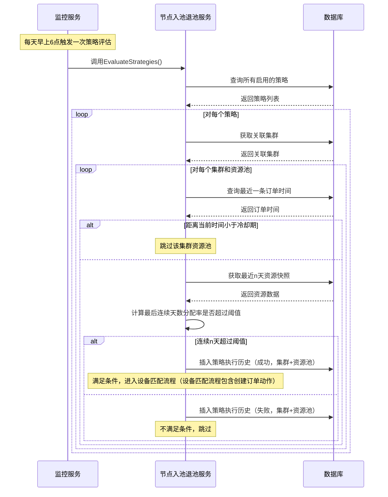
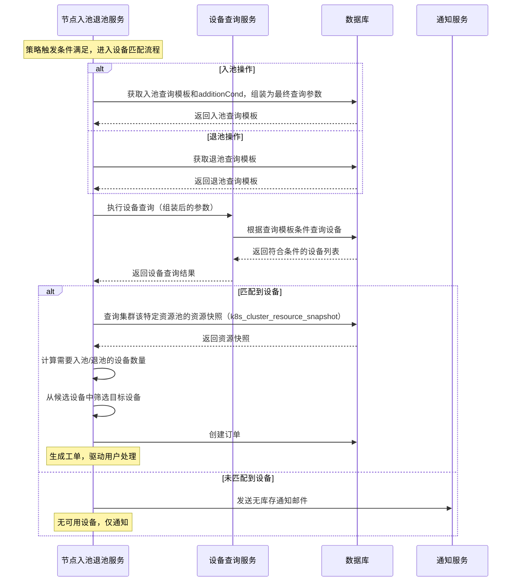
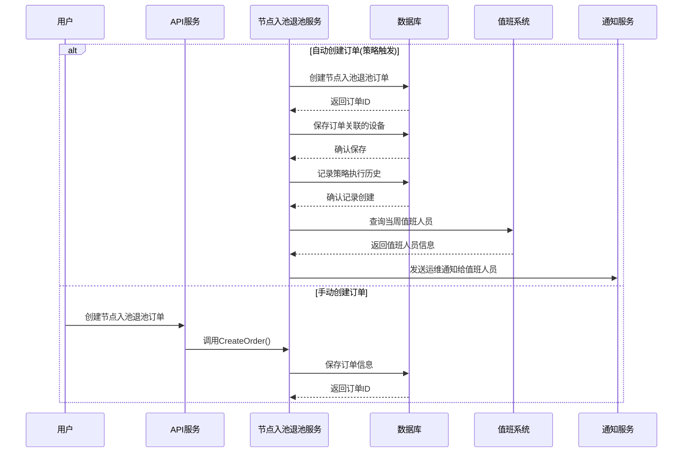
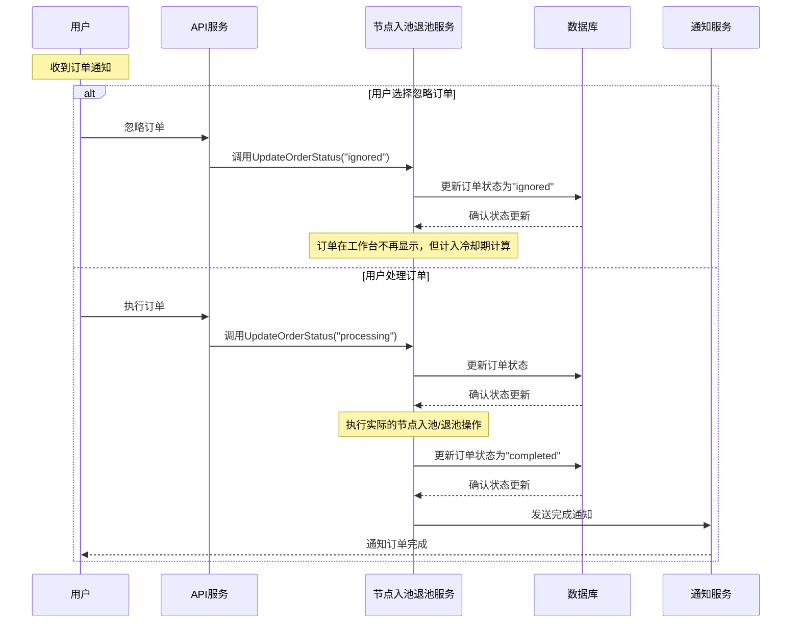
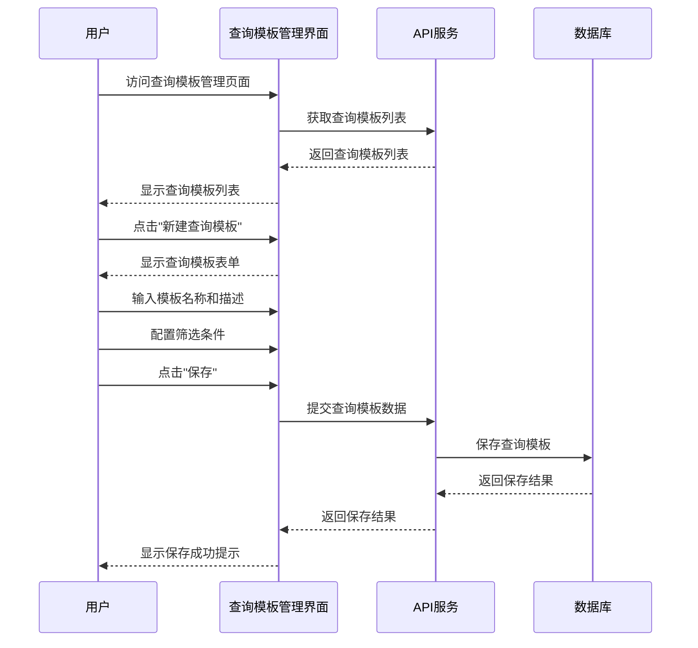
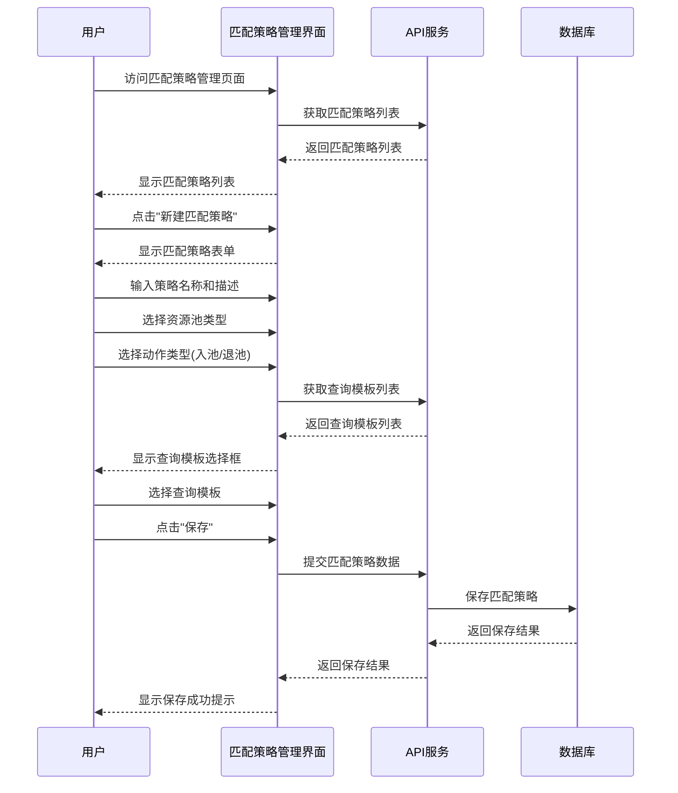
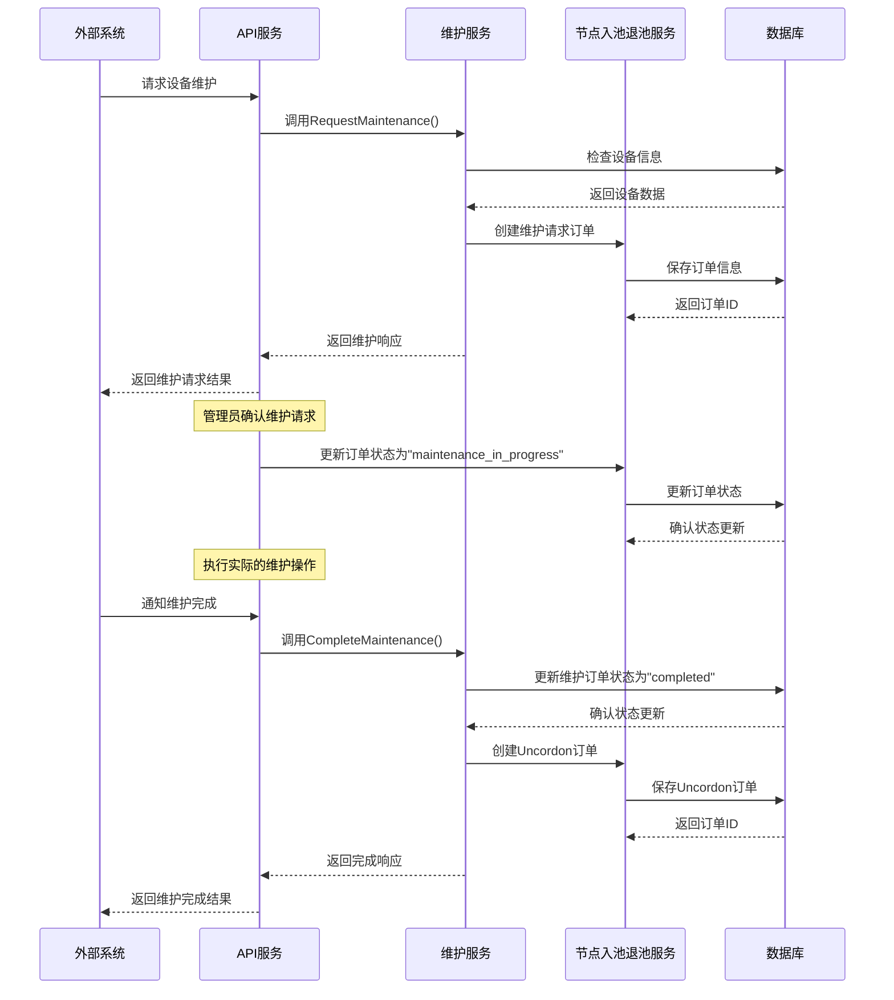
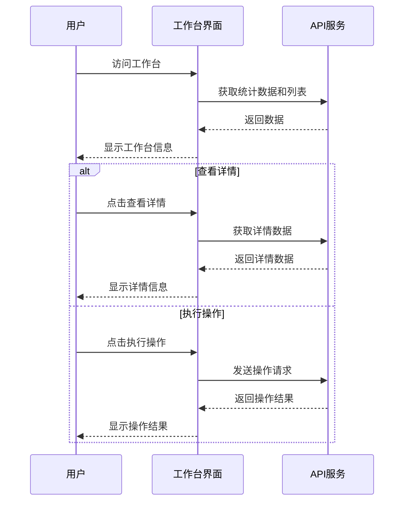
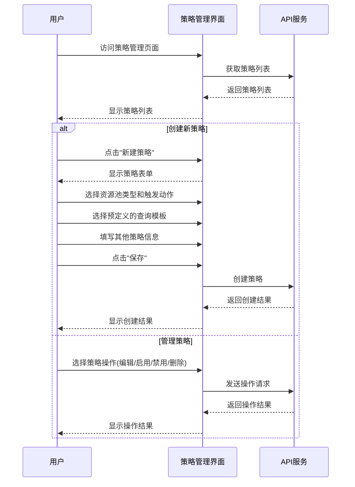
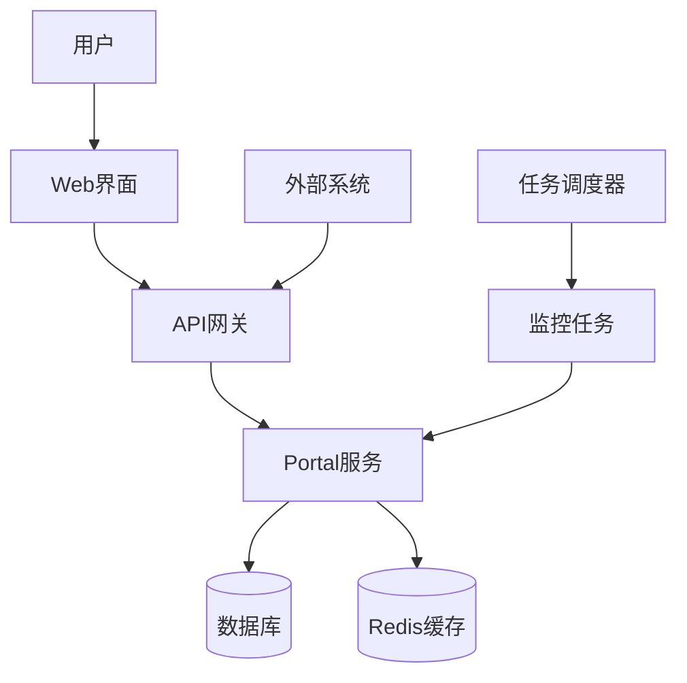

# K8s 集群节点入池退池管理系统设计文档

## 1. 系统概述

K8s 集群节点入池退池管理系统 (以下简称“本系统”) 是一个用于监控和管理 Kubernetes 集群节点资源的平台，它能够根据预设的策略自动或手动进行节点的入池和退池操作，以优化资源利用率和应用性能。系统提供了可视化的工作台，用于监控集群资源使用情况、管理节点入池退池策略 (ElasticScalingStrategy)，并处理由此产生的节点入池退池订单 (ElasticScalingOrder)。

### 1.1 系统目标

- 提供集群资源使用情况的实时监控
- 支持基于阈值的自动节点入池退池策略配置
- 实现资源池的自动入池和退池操作
- 支持设备维护请求的处理和管理
- 提供完整的操作历史记录和通知机制

### 1.2 核心功能

- 集群资源监控与统计
- 节点入池退池策略管理
- 节点入池退池订单处理
- 设备维护管理
- 通知和报告系统

## 2. 系统架构

### 2.1 整体架构

系统采用前后端分离的架构，主要包括以下组件：

1. **前端应用**：基于 React 和 Ant Design 的单页应用
2. **后端服务**：基于 Go 语言的 RESTful API 服务
3. **定时任务**：负责策略评估和资源监控的后台任务
4. **数据库**：存储系统配置、策略、订单和历史记录
5. **缓存服务**：使用 Redis 进行分布式锁和数据缓存
6. **通知服务**：支持邮件、系统内通知等多种通知方式

### 2.2 数据模型

系统的核心数据模型包括：

1. **节点入池退池策略 (ElasticScalingStrategy)**：定义节点入池或退池的触发条件、目标值和执行动作
2. **节点入池退池订单 (ElasticScalingOrder)**：记录节点入池或退池操作的执行状态和结果
3. **策略执行历史 (StrategyExecutionHistory)**：记录策略的执行历史
4. **资源池设备匹配策略 (ResourcePoolDeviceMatchStrategy)**：记录资源池设备匹配策略的执行状态和结果

5. **通知日志 (NotificationLog)**：记录系统发送的通知信息
6. **设备 (Device)**：记录集群中的设备信息

## 3. 核心流程

### 3.1 策略评估流程



#### 策略评估流程逻辑说明

1. **冷却期检查（按集群+资源池维度）**
    - 对每个策略，获取其关联的所有集群和资源池。
    - 针对每个集群和资源池，查询最近一条订单的时间。
    - 如果订单时间距离当前策略评估时间小于配置的冷却期天数，则跳过该集群资源池的评估。

2. **持续天数判断**
    - 若通过冷却期检查，获取该集群资源池最近n天的资源快照。
    - 计算这些天中资源分配率连续超过阈值的最大天数。
    - 仅当最后一段连续天数大于等于配置的持续天数，才生成订单。
    - 若中间有一天未达标，则重新计算连续天数，仅统计最后一段连续天数。


### 3.2 设备匹配流程



#### 设备匹配流程详细说明

1. **组装设备查询参数**
   - 入池操作时，获取资源池关联的设备查询模板，并将策略配置的 additionCond（如根据集群属性动态生成的参数）合并，形成最终的设备查询参数。
   - 退池操作则直接使用退池查询模板。

2. **设备查询**
   - 调用设备查询服务，依据组装后的条件查找所有符合要求的设备，获取候选设备列表。

3. **设备数量计算与筛选**
   - 查询集群当前的资源快照（k8s_cluster_resource_snapshot），获取容量、已用等信息。
   - 入池：根据当前分配率、目标阈值、触发阈值，计算需要新增的设备数量，使分配率降至目标阈值以下。
   - 退池：反向计算，可减少的设备数量。
   - 从候选设备中随机或按策略筛选出所需数量的设备。

4. **生成工单（订单）**
   - 若有可用设备，生成节点入池/退池订单，驱动用户后续处理。
   - 若无可用设备，则通过通知服务发送邮件，提醒用户当前无库存需尽快处理。


### 3.3 订单创建流程



### 3.4 订单处理流程



### 3.5 查询模板创建流程



### 3.6 资源池设备匹配策略创建流程



### 3.7 设备维护流程



## 4. 用户交互流程

### 4.1 工作台交互流程



### 4.2 策略管理交互流程



## 5. 系统组件详细设计

### 5.1 节点入池退池服务 (ElasticScalingService)

节点入池退池服务 (ElasticScalingService) 是系统的核心组件，负责节点入池退池策略评估、相应订单的创建和处理等核心功能。

主要功能：
- 节点入池退池策略管理（创建、更新、删除、查询）
- 节点入池退池订单管理（创建、更新状态、查询）
- 策略评估（定时评估所有启用的节点入池退池策略）
- 策略执行历史记录
- 资源池设备匹配（根据查询模板匹配设备进行入池或退池）

### 5.2 监控服务 (ElasticScalingMonitor)

监控服务负责定时触发策略评估，并确保在分布式环境中策略评估的正确执行。

主要功能：
- 定时触发策略评估
- 使用分布式锁确保单实例执行
- 监控策略评估的执行状态

### 5.3 维护服务 (MaintenanceService)

维护服务负责处理设备维护请求，包括创建维护订单、更新维护状态等。

主要功能：
- 接收外部系统的维护请求
- 创建维护订单
- 处理维护完成通知
- 创建设备恢复订单

### 5.4 通知服务

通知服务负责向用户发送各类通知，包括策略触发通知、订单状态变更通知等。

主要功能：
- 发送邮件通知
- 发送系统内通知
- 记录通知历史
- 向值班人员发送运维通知

### 5.5 资源池设备匹配服务

资源池设备匹配服务负责根据策略配置的查询模板，匹配符合条件的设备进行入池或退池操作。

主要功能：
- 根据资源池类型和查询模板匹配设备
- 支持入池和退池两种场景的设备匹配
- 随机选择符合条件的设备，直到满足策略预期结果

## 6. 数据模型详细设计

### 6.1 节点入池退池策略 (ElasticScalingStrategy)

```
ElasticScalingStrategy {
    id                     int64    // 主键
    name                   string   // 策略名称
    description            string   // 策略描述
    thresholdTriggerAction string   // 触发动作类型：pool_entry 或 pool_exit
    cpuThresholdValue      float64  // CPU使用率阈值
    cpuThresholdType       string   // CPU阈值类型：usage 或 allocated
    cpuTargetValue         float64  // 动作执行后CPU目标使用率
    memoryThresholdValue   float64  // 内存使用率阈值
    memoryThresholdType    string   // 内存阈值类型：usage 或 allocated
    memoryTargetValue      float64  // 动作执行后内存目标使用率
    conditionLogic         string   // 条件逻辑：AND 或 OR
    durationMinutes        int      // 持续时间（分钟）
    cooldownMinutes        int      // 冷却时间（分钟）
    deviceCount            int      // 设备数量
    nodeSelector           string   // 节点选择器
    resourceTypes          string   // 资源类型列表，逗号分隔
    entryQueryTemplateID   int64    // 入池设备查询模板ID
    exitQueryTemplateID    int64    // 退池设备查询模板ID
    status                 string   // 状态：enabled 或 disabled
    createdBy              string   // 创建者
    createdAt              datetime // 创建时间
    updatedAt              datetime // 更新时间
}
```

### 6.2 节点入池退池订单 (ElasticScalingOrder)

```
ElasticScalingOrder {
    id                     int64    // 主键
    orderNumber            string   // 唯一订单号
    clusterId              int64    // 关联集群ID
    strategyId             int64    // 关联策略ID(手动订单可为NULL)
    actionType             string   // 订单操作类型
    status                 string   // 订单状态：pending, processing, completed, failed, cancelled, ignored
    deviceCount            int      // 请求的设备数量
    deviceId               int64    // 涉及的特定设备ID(维护订单)
    createdBy              string   // 创建者
    executor               string   // 执行人
    executionTime          datetime // 执行时间
    completionTime         datetime // 完成时间
    failureReason          string   // 失败原因
    maintenanceStartTime   datetime // 维护开始时间
    maintenanceEndTime     datetime // 维护结束时间
    externalTicketId       string   // 外部工单号
    strategyTriggeredValue string   // 策略触发时的具体指标值
    strategyThresholdValue string   // 策略触发时的阈值设定
    createdAt              datetime // 创建时间
    updatedAt              datetime // 更新时间
}
```

### 6.3 查询模板 (QueryTemplate)

```
QueryTemplate {
    id          int64    // 主键
    name        string   // 模板名称
    description string   // 模板描述
    groups      string   // 筛选组列表，JSON格式
    createdBy   string   // 创建者
    updatedBy   string   // 更新者
    createdAt   datetime // 创建时间
    updatedAt   datetime // 更新时间
}
```

### 6.4 资源池设备匹配策略 (ResourcePoolDeviceMatchingPolicy)

```
ResourcePoolDeviceMatchingPolicy {
    id                  int64    // 主键
    name                string   // 策略名称
    description         string   // 策略描述
    resourcePoolType    string   // 资源池类型
    actionType          string   // 动作类型：pool_entry 或 pool_exit
    queryTemplateId     int64    // 关联的查询模板ID
    status              string   // 状态：enabled 或 disabled
    createdBy           string   // 创建者
    updatedBy           string   // 更新者
    createdAt           datetime // 创建时间
    updatedAt           datetime // 更新时间
}
```

## 7. API 接口设计

### 7.1 策略管理接口

| 接口                                  | 方法   | 描述                     |
|--------------------------------------|--------|-------------------------|
| /elastic-scaling/strategies          | GET    | 获取策略列表              |
| /elastic-scaling/strategies          | POST   | 创建新策略                |
| /elastic-scaling/strategies/:id      | GET    | 获取策略详情              |
| /elastic-scaling/strategies/:id      | PUT    | 更新策略                  |
| /elastic-scaling/strategies/:id      | DELETE | 删除策略                  |
| /elastic-scaling/strategies/:id/status | PUT  | 更新策略状态              |

### 7.2 订单管理接口

| 接口                                  | 方法   | 描述                     |
|--------------------------------------|--------|-------------------------|
| /elastic-scaling/orders              | GET    | 获取订单列表              |
| /elastic-scaling/orders              | POST   | 创建新订单                |
| /elastic-scaling/orders/:id          | GET    | 获取订单详情              |
| /elastic-scaling/orders/:id/status   | PUT    | 更新订单状态              |
| /elastic-scaling/orders/:id/devices  | GET    | 获取订单关联的设备         |

### 7.3 查询模板接口

| 接口                                  | 方法   | 描述                     |
|--------------------------------------|--------|-------------------------|
| /device-query/templates              | GET    | 获取查询模板列表           |
| /device-query/templates              | POST   | 创建查询模板              |
| /device-query/templates/:id          | GET    | 获取查询模板详情           |
| /device-query/templates/:id          | PUT    | 更新查询模板              |
| /device-query/templates/:id          | DELETE | 删除查询模板              |
| /device-query/query                  | POST   | 执行设备查询              |

### 7.4 资源池设备匹配策略接口

| 接口                                  | 方法   | 描述                     |
|--------------------------------------|--------|-------------------------|
| /resource-pool/matching-policies     | GET    | 获取匹配策略列表           |
| /resource-pool/matching-policies     | POST   | 创建匹配策略              |
| /resource-pool/matching-policies/:id | GET    | 获取匹配策略详情           |
| /resource-pool/matching-policies/:id | PUT    | 更新匹配策略              |
| /resource-pool/matching-policies/:id | DELETE | 删除匹配策略              |
| /resource-pool/matching-policies/:id/status | PUT | 更新匹配策略状态       |

## 8. 设备匹配策略设计

### 8.1 设计概述

设备匹配策略是节点入池退池管理系统的核心组件之一，用于在策略触发时根据预定义的查询条件匹配合适的设备进行入池或退池操作。设备匹配策略基于查询模板（QueryTemplate）实现，每个节点入池退池策略 (ElasticScalingStrategy) 可以配置两个查询模板：入池查询模板和退池查询模板。

### 8.2 查询模板结构

查询模板采用灵活的组合条件结构，支持复杂的设备筛选逻辑：

1. **筛选组（FilterGroup）**：多个筛选组之间可以使用 AND 或 OR 逻辑连接
2. **筛选块（FilterBlock）**：每个筛选组包含多个筛选块，筛选块之间可以使用 AND 或 OR 逻辑连接
3. **筛选条件**：每个筛选块定义一个具体的筛选条件，包括筛选类型、条件类型、键和值

### 8.3 筛选类型

系统支持三种主要的筛选类型：

1. **设备字段（device）**：直接匹配设备表中的字段，如 CPU 架构、内存大小、设备状态等
2. **节点标签（nodeLabel）**：匹配 Kubernetes 节点的标签
3. **节点污点（taint）**：匹配 Kubernetes 节点的污点

### 8.4 设备匹配策略的优势

1. **灵活性**：支持复杂的条件组合，满足各种设备筛选需求
2. **可重用性**：查询模板可以在多个策略中重用
3. **可维护性**：查询模板可以独立于策略进行管理和更新
4. **可扩展性**：系统设计支持添加新的筛选类型和条件类型

## 9. 部署架构



## 10. 未来扩展

1. **预测性节点调整**：基于资源使用趋势，提前进行节点入池或退池
